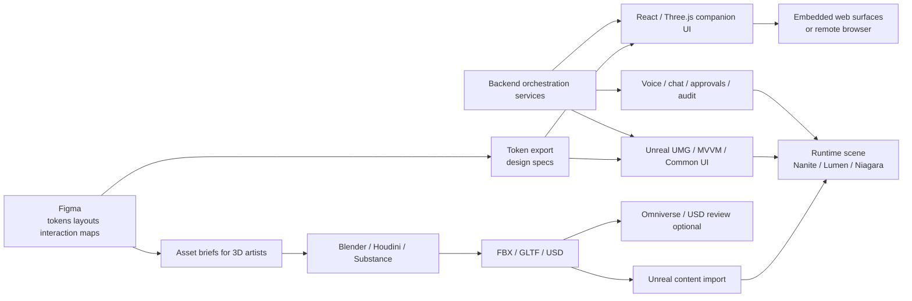
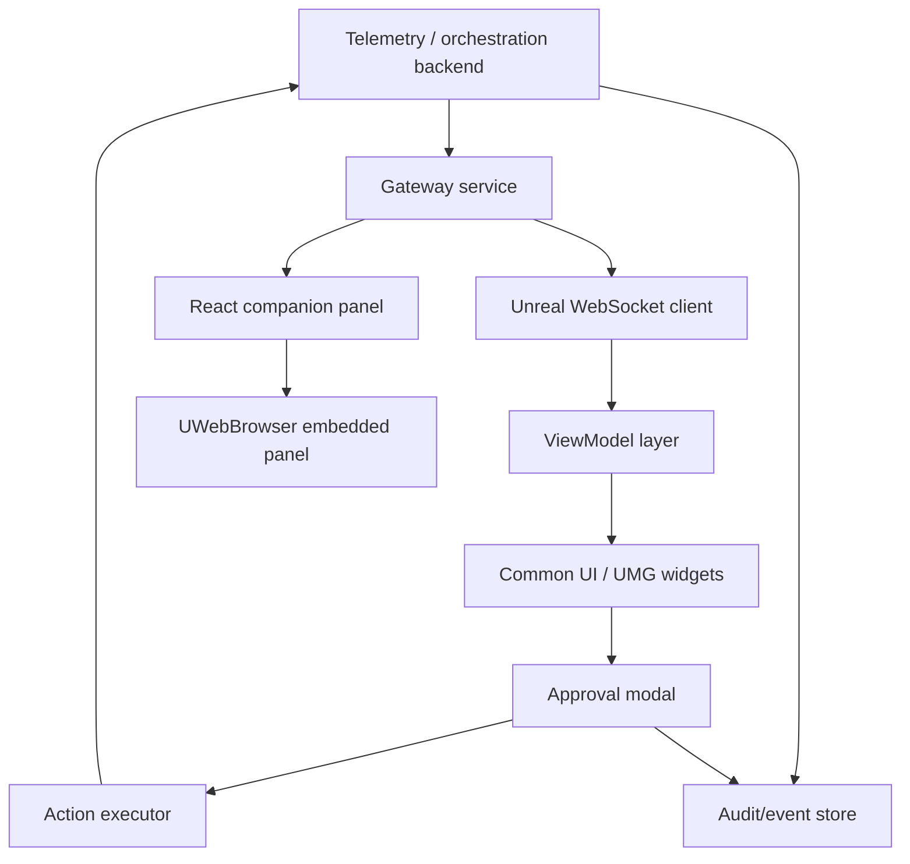

# Production Blueprint for a Master AI Orchestrator Command Center

## Executive summary

The strongest production path is **not** “Figma does everything.” It is a **hybrid pipeline** in which Figma owns design system logic, tokens, layouts, and interaction blueprints; Blender, Substance, Houdini, and asset marketplaces provide the real visuals; Unreal Engine owns the **shipping runtime**; and OpenUSD/Omniverse is used selectively as an interchange, review, and simulation layer where it adds value. Figma’s current strengths are Dev Mode, variables, prototyping, export, and plugins—not native AAA 3D worldbuilding or packaged real-time runtime delivery. Figma exports static assets such as SVG, PNG, JPG, and PDF, and its Variables/Dev Mode stack is well suited to design tokens and state variants, especially on Professional plans with expanded variable-mode limits. citeturn1search0turn1search1turn1search3turn1search11turn1search19

If your final product is meant to feel “NVIDIA / Unreal / AAA,” the recommended shipping stack is: **Figma → tokens/specs → asset sourcing and custom hero asset production → Unreal Engine 5 runtime using UMG/Common UI/MVVM + Nanite/Lumen/Niagara → optional React/Three.js companion surfaces inside a web panel or remote browser → backend orchestration services via Docker/GitHub Actions → voice/chat using realtime APIs**. Unreal provides the core building blocks you need: Widget Blueprints/UMG for interface rendering, Common UI for layered navigation, MVVM for data binding, Nanite for very high geometry density, Lumen for dynamic GI/reflections, Niagara for holograms/VFX, Web Browser widgets for embedded HTML surfaces, and Pixel Streaming for browser delivery over WebRTC. citeturn0search8turn18search0turn18search5turn18search9turn0search9turn0search10turn0search7turn6search1turn6search12

The most important architecture decision is this: **do not make Omniverse the shipping shell if Unreal is your final runtime.** NVIDIA’s current Omniverse Unreal Connector documentation states that the connector is compatible through UE 5.3, shows **no connector for UE 5.4 and 5.5**, and also states that the Omniverse USD/MDL plugins are **editor-only** and cannot be used as packaged shipping projects. That makes Omniverse valuable for USD exchange, collaborative review, Nucleus checkpoints, and specialized simulation/streaming workflows—but a risky choice for the final packaged product shell compared with native Unreal. citeturn25search0turn25search6turn25search15turn25search8

The highest-ROI execution model is therefore: **buy the commodity**, **custom-build the signature**, and **reserve engineering effort for orchestration, approvals, telemetry, and runtime polish**. Buy environment kits, base command-room modules, scanned surfaces, hologram/VFX starter packs, secondary props, and motion placeholders. Custom-build the hero avatar, the command-center “energy core,” the branded hologram language, the approval UX, and the exact orchestration data model. That gives you a genuinely premium result without wasting senior engineering time rebuilding commodity 3D packs that already exist. citeturn21view0turn21view1turn21view4turn23search0turn23search1turn20search8

## Recommended pipeline and phases

The recommended end-to-end workflow is below. The key principle is to keep **design intent**, **source assets**, **runtime assets**, and **live operational state** separate, so that visual teams, runtime engineers, and AI/backend teams can work in parallel without corrupting each other’s source of truth. Variables and design tokens should flow from Figma into a structured token layer; source 3D should remain in Blender/Houdini/Substance/OpenUSD; Unreal should ingest only validated runtime-ready assets; and telemetry/actions should come from service APIs, not be hard-coded into UI Blueprints. This separation is exactly where Figma Variables, tokens tooling, OpenUSD layering, Unreal MVVM, Dockerized services, and CI automation each earn their place. citeturn1search3turn17search0turn17search2turn2search2turn25search22turn18search0turn6search3turn6search18



**Phase framing.**  
A realistic production program breaks into six phases:

**Vision lock.** Freeze the visual north star, information architecture, control taxonomy, and “what must feel premium” before building any final art. Use Figma Variables/Dev Mode for states and tokenized HUD components, and use Vectary/Spline only for fast visual proofs rather than final runtime deliverables. citeturn1search0turn1search3turn8search15turn9search0

**System design.** Define the orchestration contract first: projects, agents, workflows, approvals, logs, telemetry channels, voice intents, and action boundaries. This is where MVVM/Common UI architecture in Unreal, WebSockets for live updates, and remote AI tool integrations should be decided. citeturn18search0turn18search9turn18search3turn16search5turn16search22

**Asset foundation.** Buy environment and HUD starter assets early, then build custom hero assets on top. Quixel/Megascans and Fab are directly accessible from Unreal; MetaHumans are available via MetaHuman Creator and Quixel Bridge paths; KitBash3D supports Unreal, Blender, Houdini, FBX, and OpenUSD; and marketplace packs can drastically shorten look-dev time. citeturn5search6turn20search10turn5search16turn5search14turn28image2

**Runtime vertical slice.** Build one fully working room with live telemetry, a functioning avatar state loop, one approval flow, one workflow trigger, logging, and voice/chat. The runtime slice should test Nanite/Lumen/Niagara, not just UI mockups. Epic’s docs recommend profiling and scalability tuning early, because rendering, streaming, and VFX tradeoffs are foundational—not post-launch cleanup. citeturn0search9turn0search10turn0search7turn26search0turn26search1turn26search15

**Production scaling.** Expand from one room/one workflow into the full command center, add world partition/HLODs if needed, formalize pipeline QA, and lock developer handoff conventions. If Omniverse is used, keep it in the interchange/review lane and not in the packaged runtime lane. citeturn25search8turn25search15

**Hardening and deployment.** Add audit guarantees, role-based approvals, packaging, remote delivery, voice reliability, GPU budgets, observability, and CI/CD. Pixel Streaming is the clean route for browser access to a full UE app over WebRTC; GitHub Actions and Docker Compose are the practical backbone for service-side automation. citeturn6search0turn6search12turn6search2turn6search3

**Sample visual reference direction.**  
Use four visual pillars: **MetaHuman-grade facial fidelity** for any human-visible assistant layer, **clean sci-fi modular command architecture** for the room shell, **dense hologram language** for information surfaces, and **select exterior skyline/world references** for scale and drama. Representative sources for that look are MetaHuman materials from Epic, KitBash3D’s Neo Tokyo II, and Fab hologram/command-center packs. citeturn5search0turn28image2turn23search0turn32image3

## Tools and plugins

The stack below is the most practical combination I’d recommend for this project. The short version is: **Figma for tokens/specs**, **Blender/Substance/Houdini for source creation**, **Fab/Quixel/KitBash and select marketplaces for commodity assets**, **Unreal for runtime**, **React/Three only where web UI is truly better**, **OpenAI/Claude for development automation and voice/tool orchestration**, and **Omniverse only where USD collaboration is worth the overhead**. citeturn17search0turn3search18turn4search1turn5search6turn16search0turn16search2turn25search0

| Tool or plugin | Platform | Best use in this project | Recommendation | Source link |
|---|---|---|---|---|
| Figma Variables + Dev Mode | Figma | Tokens, state variants, component behavior, handoff | Core | citeturn1search0turn1search3turn1search8 |
| Tokens Studio for Figma | Figma | Externalized design tokens and documentation | Core | citeturn17search0turn17search6turn17search13 |
| Figma Make | Figma | Quick HTML/CSS/JS prototypes, not final Unreal UI | Optional | citeturn17search20 |
| Figma2UMG | Figma + Unreal | Import Figma layouts into native UMG widgets | Strong accelerator for prototypes and HUD scaffolding | citeturn23search5turn23search3 |
| Vectary plugin for Figma | Figma + Vectary | Put Figma frames onto 3D mockups and concept surfaces | Useful for concepting, not source-of-truth production | citeturn8search15turn8search3 |
| Spline / Hana | Browser + Figma | Fast interactive 3D concepting, SVG-to-3D exploration, code API experiments | Use for proofs, not final AAA runtime | citeturn9search2turn9search4turn9search11 |
| LottieFiles for Figma | Figma + web | Export lightweight UI motion assets | Useful for web companion UI, limited for AAA 3D runtime | citeturn8search1turn8search13turn8search19 |
| Blender | DCC | Modeling, rig cleanup, glTF/FBX/USD interchange | Core | citeturn3search0turn3search3turn3search18 |
| Substance 3D Painter | DCC | PBR texturing and export templates | Core | citeturn4search0turn4search18 |
| Houdini Engine for Unreal | Houdini + Unreal | Procedural room kits, hologram emitters, cable systems, VFX tooling | Strong value for repeatable environment/VFX systems | citeturn4search1turn4search2turn4search4turn4search12 |
| Fab in Unreal | Unreal | Acquire assets/plugins directly in-editor | Core | citeturn5search6turn15search4 |
| Quixel / Megascans | Unreal + Fab | High-quality surfaces, props, vegetation, scanned elements | Core for materials/secondary set dressing | citeturn20search8turn20search10turn20search3 |
| MetaHuman + MetaHuman Animator | Unreal | High-fidelity human assistant or humanized operator | Use if you want a human face; skip for fully robotic avatar | citeturn5search0turn5search13turn5search16 |
| Mixamo | Web | Placeholder body motion and rapid animation tests | Good for prototypes only | citeturn29search2 |
| UMG + Widget Blueprints | Unreal | Native shipping HUD and command UI | Core | citeturn0search8turn0search12turn0search16 |
| MVVM Viewmodel | Unreal | Clean data binding between telemetry and UI | Core | citeturn18search0turn18search4 |
| Common UI | Unreal | Layered navigation, popups, complex menu flows | Core | citeturn18search5turn18search9turn18search13 |
| Nanite | Unreal | High-density geometry for room shell and props | Core | citeturn0search9turn33search0turn33search3 |
| Lumen | Unreal | Dynamic GI and reflections | Core | citeturn0search10turn0search14 |
| Niagara | Unreal | Holograms, particles, energy-core VFX, HUD spatial effects | Core | citeturn0search7turn0search11turn26search19 |
| Web Browser Widget | Unreal | Embed React/Three.js panels in UMG | Use only for specialty surfaces | citeturn6search1turn6search5turn6search17 |
| Pixel Streaming | Unreal | Browser delivery of the whole UE app over WebRTC | Best for remote command-center access | citeturn6search0turn6search12turn6search16 |
| Omniverse USD Composer + Nucleus | NVIDIA | USD review, checkpoints, cross-DCC collaboration | Optional and valuable, but not the primary shipping shell | citeturn2search0turn25search8turn25search22 |
| Omniverse Unreal Connector | NVIDIA + Unreal | Unreal↔USD export/import | Use with caution because current docs restrict connector/runtime usage | citeturn25search6turn25search15 |
| React + React Three Fiber + Three.js | Web | Graph-heavy panels, knowledge maps, non-critical companion UI | Secondary surface only | citeturn7search0turn7search2turn7search1 |
| OpenAI Responses + Realtime API | Backend + voice | Tool-calling orchestration, browser voice/chat, realtime speech | Core for assistant and voice control | citeturn16search1turn16search5turn19search6turn19search13 |
| Claude Code + MCP | Dev workflow | Repo-aware coding, automation, MCP tools | Strong for developer productivity and internal automations | citeturn16search2turn16search3turn16search7 |
| Docker Compose | Infra | Local service graph for APIs, telemetry, auth, logging | Core | citeturn6search3turn6search11 |
| GitHub Actions | CI/CD | Automated build, test, lint, packaging, deploy gates | Core | citeturn6search2turn6search18turn6search22 |
| rdBPtools | Unreal | Optimized prefab-like grouped instancing for environments | Lesser-known but high-value optimization helper | citeturn22search18 |
| ZibraVDB | Unreal | Better real-time volumetrics for hero effects | Optional premium enhancement | citeturn22search1turn15search16 |

**Direct recommendation.**  
For this specific product, the “core” subset should be: **Figma Variables + Tokens Studio + Figma2UMG + Blender + Substance + Houdini Engine + Fab/Quixel + Unreal UMG/MVVM/Common UI + Nanite/Lumen/Niagara + OpenAI Realtime + Docker + GitHub Actions**. Add **MetaHuman** only if you want a human-like face; add **Omniverse/Nucleus** only if you truly need USD-centered collaboration across teams or tools. citeturn17search0turn23search5turn4search1turn5search6turn18search0turn0search9turn19search6turn6search2turn6search3

## Asset strategy and marketplace picks

The correct sourcing strategy is to divide assets into **commodity**, **hero**, and **signature interaction** tiers.

**Commodity assets to buy.**  
Buy modular room shells, generic command consoles, secondary props, decals, base hologram materials, worldbuilding kits, and scanned materials. Fab, Quixel, KitBash3D, ArtStation Marketplace, CGTrader, TurboSquid, and Sketchfab all already carry variants of these. KitBash3D offers explicit Unreal/Blender/Houdini/FBX/OpenUSD support on packs like Neo Tokyo II; Fab exposes Unreal-native content in-editor; Quixel provides high-resolution PBR-calibrated scans; and ArtStation/CGTrader/TurboSquid are efficient sources for decals, placeholder robots, and specialty props. citeturn28image2turn5search6turn20search8turn24view2turn13search2turn14search6

**Hero assets to custom-build.**  
Custom-build the **Master AI Orchestrator avatar**, the **energy core / cognition reactor**, the **central command chamber layout**, the **main hologram language**, and the **approval interaction language**. Those are the things users will remember. Marketplace assets are too generic to carry brand identity at NVIDIA-grade polish. A premium result comes from putting your art budget into those hero elements, then surrounding them with bought commodity systems. citeturn23search0turn23search1turn32image3

**Marketplace picks and procurement shortlist.**  
The table below is the practical shortlist I would start buying/evaluating first.

| Pick | Source marketplace | Observed price | Why it is useful | Main drawback | License note | Source link |
|---|---|---:|---|---|---|---|
| Neo City mini kit | KitBash3D | $0 | Free look-dev benchmark for exterior/world scale and lighting tests | Not enough for a full hero environment | Kit purchases are licensed for larger works; no raw redistribution | citeturn21view1turn13search0 |
| Neo Tokyo II | KitBash3D | $145 | Strong premium skyline/exterior layer; supports Unreal, Blender, Houdini, FBX, OpenUSD | Exterior/city focused, not a command room | Perpetual kit license, tiered by company size | citeturn21view0turn28image2turn13search9 |
| Modular Control Center Extended Version | Fab | Pack 1 $40, Pack 2 $60; bundle savings noted | Fast modular interior blockout and control-room assembly | Visual language may need major customization | Fab Standard license tiers apply | citeturn21view4turn15search1turn15search0 |
| Modular SciFi Command Center | Fab | Public page did not expose price in retrieved result | Good dark modular room shell for early vertical slice | Price opacity; may still need custom rework | Fab Standard license tiers apply | citeturn32image3turn15search1 |
| HOLOGRAM DISPLAY Pack | Fab | Public page did not expose price in retrieved result | Includes hologram display models, materials, widget interaction blueprints, icons | Generic unless art-directed heavily | Fab Standard license tiers apply | citeturn23search0turn15search0 |
| Hologram VFX With Niagara Pack 4 | Fab | Public page did not expose price in retrieved result | Strong VFX starter: 33+ examples, 26+ Niagara systems, 70+ materials | Can make the product look templated if overused | Fab Standard license tiers apply | citeturn23search1turn15search0 |
| Advanced Hologram Material Package | Fab | Public page did not expose price in retrieved result | Good material base for screen and in-world hologram surfaces | Needs custom art direction and restraint | Fab Standard license tiers apply | citeturn23search2turn15search0 |
| Figma2UMG | Fab / GitHub | From Free | Huge speed-up for getting Figma HUDs into Unreal UMG | Best for scaffolding; still needs production refactor | Fab Standard license / open-source repo now available | citeturn23search3turn23search5 |
| Sci-fi HUD Screen Animated | ArtStation Marketplace | $8.95 | Cheap motion/HUD prop reference or placeholder | Small-scope asset, not a complete UI system | Standard and broader marketplace EUA terms apply | citeturn11search0turn14search2 |
| 400+ Sci-fi UI/HUD decals vol 07 | ArtStation Marketplace | $6.03 standard / $46.74 extended commercial | Excellent fast-detail pack for Substance, decals, UI overlays, concept art | Graphic style can feel stock unless curated | Standard license is limited; extended commercial removes sales/view caps | citeturn24view2turn14search2 |
| Robotic Virtual Assistant Rigged For Blender | TurboSquid | $79 | Useful placeholder robot base for exploration, previs, or secondary AI entities | Blender-first; likely needs full retopo/material/rig cleanup for hero use | TurboSquid royalty-free license; no redistribution / stock competition uses | citeturn12search7turn21view5turn14search0turn14search6 |
| Sci‑Fi Robot Pack Futuristic Humanoid and Quadruped Robots | CGTrader | $5.99 per listed item in pack snippet | Very cheap placeholder robots with FBX/GLTF/BLEND coverage | Placeholder quality; not hero-ready | CGTrader Royalty Free allows commercial use when embedded/non-extractable | citeturn12search9turn13search2turn13search5 |
| ROBO G‑8 Rigged for Unreal Engine / Unity / Mixamo | CGTrader | $7 in retrieved listing snippet | Ultra-cheap motion-blocking humanoid robot reference | Quality likely insufficient for hero assistant | CGTrader Royalty Free applies | citeturn31search5turn13search2 |
| Sci‑Fi Command Center VR and Game‑Ready | Sketchfab | Price not exposed in retrieved view; linked onward to Fab | Good visual benchmark and quick GLB/FBX proxy evaluation | Check exact license and source-of-sale carefully | Sketchfab license varies by listing; this one is marked NoAI and links to Fab | citeturn30view0turn13search1 |

**License sanity check.**  
Fab uses Standard licenses with Personal and Professional tiers; KitBash3D licenses are based on company-size tiers and are for use in larger works, with perpetual use for purchased kits; CGTrader’s Royalty Free license allows commercial use when the model is incorporated so third parties cannot extract it; TurboSquid’s models are royalty-free for personal/business projects forever unless otherwise noted; ArtStation splits scope via Standard vs Extended Commercial usage; and Sketchfab licensing is listing-specific, so you must verify each asset individually. This is the minimum legal review before you buy anything for a commercial control center. citeturn15search0turn15search1turn13search0turn13search9turn13search2turn14search6turn24view2turn13search1

**Recommended custom commissions and briefs.**  
Commission these three assets first:

**Master AI Orchestrator avatar.**  
Deliverables: hero skeletal mesh, game-ready materials, facial blendshapes or control-rig-ready face, idle and gesture poses, emissive accents, variant states (neutral / active / alert / approval-required), LODs, and Unreal test scene. Brief: “A premium humanoid or semi-humanoid orchestrator with elegant, non-military industrial design; intelligence must read immediately; surfaces should combine brushed ceramic/metal, clean seams, subtle emissive channels, and a premium AI-core area; usable at close-up camera distance.” Use MetaHuman only if you want explicitly human facial realism; otherwise build a custom robotic face/body around an Unreal-friendly rig. citeturn5search0turn5search13turn33search4

**Energy core / cognition reactor.**  
Deliverables: modular core mesh set, Niagara emitters, animated material instances, mesh variants for low/high complexity, sound-hook markers, and control parameters for pulse speed, alert level, and mode state. Brief: “A central holographic or semi-physical ‘brain’ that visualizes system cognition, not fantasy magic; should support standby, scan, compute, approval-waiting, alert, and execution modes.” Niagara and hologram material packs are excellent references, but the final effect should be custom. citeturn0search7turn23search1turn23search2

**Signature HUD VFX language.**  
Deliverables: icon atlas, SVG master source, decal atlas, emissive masks, Niagara widgets, UMG-ready asset sheets, typography treatment, and animation rules. Brief: “Build a visual language for decision confidence, workflow status, memory retrieval, escalation, approval, and logs. The style should feel aerospace/AI-operational rather than gamey cyberpunk.” Figma SVG exports and tokenized variables are the correct upstream source for icon and status logic; ArtStation decal packs and Fab hologram packs are references, not the shipped identity. citeturn1search1turn1search11turn24view2turn23search0

**Recommended technical specs.**  
These are the production targets I would hand to artists and tech art as the initial acceptance criteria:

| Asset class | Recommended target spec |
|---|---|
| Hero avatar | LOD0 roughly 80k–180k visible triangles depending on silhouette complexity; 4–6 material slots max; 4K face/torso, 2K limbs, 1K accessories; full skeleton + facial shapes if mouth/eyes are visible close-up; FBX for Unreal ingest, USD for interchange, GLB for previews |
| Static command-room modules | Nanite-ready static meshes; source mesh can stay high-detail; modular spans around 1 m / 2 m / 4 m pieces; 2K–4K tiling/trim textures; 1–3 material slots per module; collision meshes included |
| Secondary props and consoles | 10k–80k visible triangles each depending on camera importance; prefer trim sheets and instancing; emissive masks separated; 2K textures typical |
| Hologram meshes | Keep mesh light and let materials/Niagara carry the complexity; 1K–2K alpha/emissive atlases; material parameterization mandatory |
| UI asset source | Master icons in SVG plus raster atlases for Unreal/web; Figma SVG/PDF export constraints mean you should preserve clean vector masters and generate runtime atlases in build/export tooling |
| Skeletal/Nanite readiness | Static and skeletal assets can now carry Nanite settings in current UE docs, but validate the exact feature mix you need in your project version before locking the character pipeline |

These targets are a **recommended production envelope**, derived from Unreal’s current Nanite capabilities, Skeletal Mesh requirements, Figma export behavior, and marketplace/runtime realities—not a law of nature. citeturn33search0turn33search3turn33search4turn1search1

## Runtime architecture and implementation plan

The strongest Unreal HUD architecture for this project is **native UMG first, web surfaces second**. Use **Widget Blueprints + Common UI + MVVM** for all mission-critical controls: approvals, command layers, task queues, system health, workflow triggers, logs, safe-mode interruptions, and operator navigation. Use **embedded web panels** only for things that are genuinely easier in web tech: dense graphs, knowledge maps, rich text/code views, mini dashboards, or collaborative browser-native panels. This keeps the product stable, gamepad/mouse/keyboard friendly, and testable, while still letting you use React/Three where it adds leverage. citeturn0search8turn18search0turn18search9turn6search1turn7search0turn7search2

**Interactive HUD inside Unreal.**  
Use UMG Widget Blueprints for visual composition, Common UI for layered activatable screens and popups, and MVVM ViewModels as the state boundary between backend telemetry and the rendered interface. Feed telemetry into ViewModels from a service layer and never directly from random Blueprints. Unreal’s WebSockets runtime module is appropriate for live telemetry subscriptions; Remote Control API is powerful but should be reserved for internal/editor tooling because Epic documents it as a web-controlled engine interface and marks the HTTP/WebSocket references with “use caution when shipping.” citeturn18search0turn18search21turn18search3turn18search14turn18search6turn18search7



**Voice and chat hooks.**  
For browser or cross-surface voice, use realtime voice APIs over **WebRTC**, not browser-side WebSockets, because the current OpenAI docs explicitly recommend WebRTC for browser and mobile clients and describe WebSockets as the server-side route. Speech-to-text, realtime transcription, TTS, and live conversational tool use are all available in the current API surface. That makes voice control very practical for commands like “show project health,” “approve staging deploy,” or “explain why the agent paused.” citeturn19search6turn19search7turn19search15turn19search1turn19search2turn19search13

**Approval system.**  
Never let the orchestrator directly execute side effects without a policy gate. The orchestration model should be:

1. Model proposes action.  
2. Policy engine classifies risk level and determines whether approval is required.  
3. UMG approval modal renders the proposed action, rationale, affected systems, rollback path, and confidence.  
4. Operator approves/denies/delegates.  
5. Executor performs the action.  
6. Audit event is appended with actor, timestamp, request payload hash, and outcome.

That pattern aligns with modern tool-calling agents and MCP-connected systems, while preserving a safe operator loop. OpenAI’s Responses API supports tool use and remote MCP; Claude also supports MCP connector patterns. citeturn16search1turn16search5turn16search17turn16search3turn16search7turn16search11

**Audit and telemetry contracts.**  
Use a consistent event schema across Unreal, web panels, and backend services.

```json
{
  "event_type": "approval.requested",
  "event_id": "evt_01J...",
  "project_id": "proj_42",
  "workflow_id": "wf_deploy_prod",
  "proposed_by": "orchestrator.master",
  "requires_human": true,
  "severity": "high",
  "summary": "Deploy agent-generated patch to production API",
  "reasoning_summary": "Canary passed. Integration tests passed. Security scan clean.",
  "affected_resources": ["api-gateway", "billing-service"],
  "rollback_plan": "Redeploy prior container image sha256:...",
  "created_at": "2026-07-11T18:30:00Z"
}
```

```json
{
  "event_type": "telemetry.snapshot",
  "source": "workflow-engine",
  "project_id": "proj_42",
  "cpu_pct": 48.3,
  "gpu_ms": 13.7,
  "queue_depth": 19,
  "active_agents": 7,
  "failed_jobs_24h": 1,
  "pending_approvals": 3,
  "ts": "2026-07-11T18:30:02Z"
}
```

```json
{
  "event_type": "audit.appended",
  "actor_type": "human",
  "actor_id": "user_boss",
  "action": "approval.accepted",
  "target": "wf_deploy_prod",
  "previous_state": "awaiting_approval",
  "new_state": "approved",
  "request_hash": "sha256:...",
  "ts": "2026-07-11T18:31:11Z"
}
```

**Sample React / Three.js → Unreal web-panel flow.**  
Keep the web panel isolated. Serve a React app that renders a Three.js/R3F scene or graph view; embed it in a UWebBrowser widget; and have both the React app and Unreal client subscribe to the same backend event bus. If you need a one-way nudge from Unreal into the web view, Unreal’s browser surface exposes JavaScript execution APIs. citeturn7search0turn7search2turn6search1turn6search13

```tsx
// web/ui-companion/src/main.tsx
import { createRoot } from 'react-dom/client'
import { Canvas } from '@react-three/fiber'
import App from './App'

createRoot(document.getElementById('root')!).render(
  <App>
    <Canvas>{/* knowledge graph / room mini-map / system topology */}</Canvas>
  </App>
)
```

```cpp
// Unreal pseudo-flow
// 1. UMG widget hosts UWebBrowser
// 2. Browser URL points to internal React app
// 3. Unreal WebSocket client subscribes to telemetry
// 4. ViewModels update native widgets
// 5. React panel separately subscribes to same gateway for graphs
```

**Developer handoff, naming, and file structure.**  
Use a repo layout that mirrors responsibility boundaries. GitHub Actions requires workflow files in `.github/workflows`, and Docker Compose should define services, networks, and volumes centrally. Everything else should be optimized for art/runtime/backend parallelism. citeturn6search2turn6search3

```text
master-ai-orchestrator/
  design/
    figma/
      tokens/
      exports/
      specs/
  source_assets/
    purchased/
      fab/
      kitbash/
      artstation/
      cgtrader/
      turbosquid/
    commissioned/
      avatar/
      energy_core/
      hud_language/
  dcc/
    blender/
    substance/
    houdini/
    usd/
  unreal/
    Config/
    Content/
      CommandCenter/
        Environments/
        Avatar/
        UI/
        VFX/
        Materials/
        Data/
      ThirdParty/
    Plugins/
      Figma2UMG/
  web/
    ui-companion/
  services/
    gateway/
    orchestrator/
    approvals/
    audit/
  infra/
    docker-compose.yml
  .github/
    workflows/
```

**Naming convention recommendation.**  
Use a strict Unreal prefix scheme from day one: `SM_` static meshes, `SK_` skeletal meshes, `M_` materials, `MI_` material instances, `T_` textures, `WBP_` widgets, `BP_` Blueprints, `DA_` data assets, `NS_` Niagara systems, `NMS_` Niagara modules, `FX_` VFX maps. Pair that with marketplace-source tags at folder level so you can later replace bought assets without breaking content references. This is recommendation, not a vendor mandate.

## Performance, CI/CD, and delivery planning

**Performance guidance.**  
Target the command center like a premium real-time application, not a film frame. Profile from the first vertical slice using Unreal Insights and scalability tiers, and treat **GPU milliseconds** as the real budget. Epic’s profiling and scalability docs emphasize that rendering features, texture streaming, and VFX decisions are foundational, while Niagara docs explicitly frame scalability as the discipline of reducing unnecessary work at both per-effect and aggregate levels. The texture streaming pool also includes UI textures and can hold other GPU-adjacent resources on some platforms, which matters for HUD-heavy command centers. citeturn26search15turn26search1turn26search2turn26search19

My recommended working budget for a desktop “operator station” target is:

- **60 FPS premium target:** aim for ~16.6 ms total frame, with **GPU ~10–12 ms** budget and **CPU game thread ~3–5 ms** for average scenes.  
- **30 FPS cinematic mode:** allow ~33.3 ms but keep interactivity-critical views on a 60 FPS fallback path.  
- Use **Nanite aggressively** on static environment geometry and large repeatable assets.  
- Use **Lumen selectively**: high for hero/demo modes, reduced scalability for routine operator views.  
- Treat **Niagara holograms** as a budget class of their own; reduce overdraw first, not just particle count.  
- Keep UI textures disciplined; test `r.Streaming.PoolSize` during vertical slice work rather than waiting for “texture pool over budget” surprises. citeturn0search14turn26search2turn26search8turn26search19turn33search0

**CI/CD approach.**  
Use **Docker Compose** to run the gateway, orchestrator service, approvals service, audit service, database, and any vector/log backends locally. Use **GitHub Actions** to lint and test the web/backend layers on every change, and to gate Unreal automation/build jobs on tagged branches or self-hosted Windows runners. Keep UE packaging jobs heavier and less frequent; keep web/API jobs cheap and constant. GitHub Actions is ideal for the YAML-defined automation layer, while Docker Compose is the right local orchestration substrate. citeturn6search2turn6search3turn6search11

**Codex / Claude integration for the development team.**  
A very effective setup is to use **Codex** and **Claude Code** as development copilots connected to your repo, docs, staging telemetry, and task system through MCP or internal tools. OpenAI’s current Codex docs describe multi-agent coding workflows and MCP extension points, while Claude Code’s docs position it as a repo-aware coding assistant with MCP connectivity for tools and remote systems. In practice, that means: Codex or Claude can open issues, generate UMG scaffolds, write Python import utilities, update React dashboards, or propose pull requests—but approval and deployment should still run through your own gated workflow. citeturn16search0turn16search4turn16search5turn16search16turn16search2turn16search22

**Timeline, roles, and budget scenarios.**  
The table below is the planning model I would use.

| Scenario | Team shape | Approximate duration | Role mix and hours | Budget range | Best fit |
|---|---|---:|---|---:|---|
| Low | Founder + senior full-stack/Unreal generalist + freelance 3D artist + part-time UI designer | 14–20 weeks | Unreal/tech art 500–800h; backend/web 300–500h; 3D art 150–300h; UI design 80–150h | $35k–$90k | Strong prototype / investor-grade vertical slice |
| Medium | Creative director/product owner, Unreal engineer, technical artist, 3D character artist, environment artist, frontend engineer, backend engineer | 12–18 weeks | Unreal 600–1,000h; backend 400–700h; web 250–500h; tech art 250–500h; environment art 250–500h; character art 180–350h | $120k–$300k | Best balance of speed, quality, and production safety |
| High | Dedicated art lead, principal Unreal engineer, gameplay/UI engineer, technical artist, VFX artist, character artist, environment artist, frontend lead, backend lead, DevOps, QA | 16–28 weeks | 3,000–7,000+ team hours | $350k–$1.2M+ | Production-grade platform with real ops hardening and showpiece polish |

**Milestone recommendation.**  
The best milestone sequence is: **brief lock → vertical slice room → avatar + core signature pass → workflow/approval hardening → remote delivery → polish/perf/legal cleanup**. Do not wait for “all assets done” before integrating telemetry and approvals. A command center without live data and safe actions is just a scene render.

## Risks and the next concrete tasks

The main project risks are not artistic taste; they are **pipeline drift**, **runtime overcomplexity**, **connector/version mismatches**, **legal sloppiness**, and **attempting too much custom art before the system architecture is proven**. The two highest-risk technical traps are: trying to shove too much of the runtime into browser tech when Unreal should own the shell, and trying to use Omniverse as the packaged runtime despite current connector/editor limitations documented by NVIDIA. The two highest-risk production traps are: buying too many generic packs without a clear branding pass, and building a gorgeous room before the approval/audit/orchestration loop is working. citeturn25search6turn25search15turn18search0turn18search9turn14search0turn13search2

**Prioritized next twenty tasks**

1. Lock the product brief into one page: what the Master AI Orchestrator can do, what requires approval, and what the demo must prove.
2. Decide the avatar strategy now: **humanized MetaHuman path** or **custom robotic hero path**.
3. Create the canonical entity model for `Project`, `Agent`, `Workflow`, `ApprovalRequest`, `AuditEvent`, and `TelemetrySnapshot`.
4. Set up the mono-repo with the recommended folder structure and naming rules.
5. Create `.github/workflows` and a `docker-compose.yml` skeleton on day one.
6. Stand up a minimal backend gateway that can emit fake telemetry over WebSocket.
7. Build the first Unreal project with UMG, Common UI, MVVM, WebSockets, Niagara, and Web Browser plugin enabled.
8. Build one “Operations Overview” screen natively in UMG first.
9. Add a single React companion panel only after the native HUD is live.
10. Buy/evaluate the first asset batch: Neo City, Neo Tokyo II, one modular command-room pack, one hologram pack, one decal pack.
11. Create a hard replacement plan for every bought asset: what stays commodity, what gets reworked, what gets replaced.
12. Commission the avatar brief with explicit deliverables, LODs, formats, and state variants.
13. Commission the energy-core brief with Niagara/material parameter requirements.
14. Convert the Figma design system into tokens using Variables + Tokens Studio.
15. Test Figma2UMG on a constrained HUD subset, not the whole file.
16. Establish export conventions: SVG master icons, PNG atlases, FBX for skeletal assets, USD for interchange, GLB for previews.
17. Build the first approval modal and wire it to a mock action executor plus audit append.
18. Add voice input on a narrow command set only, such as “show,” “approve,” “deny,” and “explain.”
19. Run the first full performance pass in Unreal Insights before adding more VFX.
20. Freeze a vertical-slice target and refuse further art expansion until that slice feels premium, live, and safe.

**Final recommendation.**  
If you want the fastest route to a genuinely next-level result, choose the **medium scenario**. Buy the room shell and hologram foundation, custom-build the avatar/core/HUD identity, ship on Unreal, keep web surfaces secondary, and use Omniverse/USD only where collaboration or review genuinely benefits from it. That is the cleanest path to “NVIDIA-level” polish without turning the project into a pipeline science experiment. citeturn25search15turn5search6turn18search9turn19search6